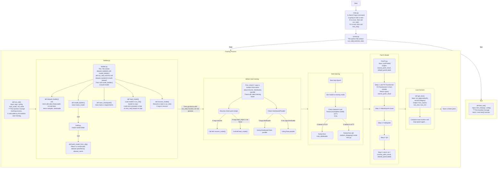

```mermaid
graph TD
    A[Start]-->  Z("main.py\n It check if input command is going to train or test.\n If it is train, then call run_net().\n If it is test, then call test_net().")
    Z --> B("runner.py\nThis python file contain run_net() and test_net().")
    subgraph TP ["Training Process"]
    C["def run_net()\n Input: args, config, train_writer, val_writer\n ***This function manage training process, \nit call builder.py first before start training "]
    C --> BD
    LS --> D("Save a check point")
    subgraph BST ["Before start training"]
    direction TB
    C2("First, check if  args is contain information\n about resume, distributed, parallel\n These will make training faster ")
    C2 --> C3("Resume check point (ckpt)")
    C3 -->|If args.resume| C33("Call def resume_model()")
    C3 -->|If args.start_ckpts is not None| C34("Call def load_model()")
    C2 --> C22("Check Distributed/Parallel")
    C22 -->|If args.distributed| C4(Using Distributed Data parallel)
    C22 -->|If not args.distributed| C5(Using Data parallel)
    end
    subgraph BD [Builder.py]
    direction TB
    D1("builder.py\n This  file contain dataset_builder() and model_builder()\n def run_net() will first call dataset_builder() to build dataset\n Then call model_builder() to build model ")
    D1-->c10["def dataset_builder()\n use torch.utils.data.DataLoader to load data\n return sampler, dataloader"]
    D1-->c20["def model_builder()\n return base_model"]
    D1-->c30["def save_checkpoint()\n Save ckpt at ./experiments"]
    D1-->c40["def load_model()\n Load model in run_net() based on args\nLoad and evaluation a ckpt on test_net() based on ckpt"]
    D1-->c50["def resume_model()\n Resume a ckpt in run_net()\nif args is resume "]
    c20 --> |Call| c21["build.py\n Inside model folder"]
    c21 -->|Call| c22["def build_model_from_cfg()\nReturn a constructed dataset specified by dataset_name"]
    end
    subgraph ST ["Start training"]
    direction TB
    S1("Start loop Epoch") --> S2("Set model to training mode")
    S2 --> S3("Check dataset to get Partial (incomplete model):\n KITTI\n PCN")
    S3 -->|If datset is PCN| S4("Partial from train_dataloader")
    S3 -->|If datset is KITTI| S5("Partial from def random_dropping() inside misc.py")
    end
    subgraph PT ["PoinTr Model"]
    direction TB
    P1("PoinTr.py\n Input: xyz(Partial)\n Output: coarse_point_cloud, rebuild_points,label")
    P1 --> P2("Step 1: Use PCTransformer\n PCTransformer is from outside\n Return query, coarse_point_cloud")
    P2 --> P3("Step 2: Rebuild point cloud")
    P3 --> P4("Step 3: FoldingNet")
    P4 --> P5("Step 4: fps")
    P5 --> P6("Step 5: return ret =(coarse_point_cloud, rebuild_points,label) ")
    end
    subgraph LS ["Lose function"]
    direction TB
    L1("def get_loss()\n Input: ret, gt(groudtruth), vector(category)\n Output: loss_coarse, loss_fine, loss_Cls")
    L1 --> L2("Compare lose function and loop epoch again ...")
    end
    end
    subgraph TS [Test]
    T1["def test_net()\n Input: test_net(args, config)\n ***This function manage tests, it use test() function"]
    end
    B -->|Train| TP
    B -->|Test| TS
    BD --> |"Then go back to def run_net() function, do rest process"| BST
    BST --> ST
    ST --> PT
    PT --> LS
    
```
