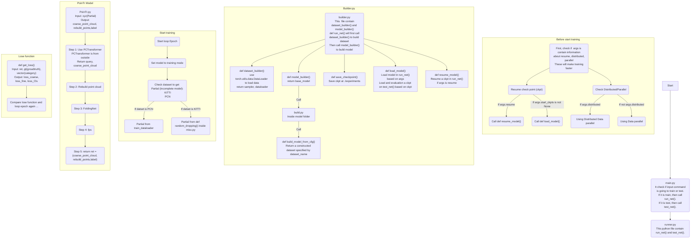

<details>
  <summary>Menu of ReadMe</summary>
  <ol>
    <li>
      <a href="#about-the-project">About The Project</a>
      <ul>
        <li><a href="#built-with">Built With</a></li>
      </ul>
    </li>
    <li>
      <a href="#getting-started">Getting Started</a>
      <ul>
        <li><a href="#prerequisites">Prerequisites</a></li>
        <li><a href="#installation">Installation</a></li>
        <ul>
        <li><a href="#step-1-set-environments">Step 1: Set environments</a></li>
        <li><a href="#step-2-set-dataset">Step 2: Set dataset</a></li> 
      </ul>
      </ul>
    </li>
    <li>
      <a href="#usage">Usage</a></li>
      <ul>
        <li><a href="#train">Train</a></li>
        <li><a href="#evaluation">Evaluation</a></li>
      </ul>
    <li><a href="#contributing">Contributing</a></li>
    <li><a href="#license">License</a></li>
    <li><a href="#contact">Contact</a></li>
    <li><a href="#acknowledgments">Acknowledgments</a></li>
  </ol>
</details>


# About The Project
 
Project Link: [https://github.com/Cmput-414/PoinTr](https://github.com/Cmput-414/PoinTr)  

This project is 3D Point Cloud Inpainting.  
In this project, we add label to modify the lose function.  
We also change the DG-CNN to improve the F-score and CDL.  
# *** DIAGRAM NOT FINISHED***


## Built With
* [![Python][Python.com]][Python-url]
* [![Pytorch][Pytorch.com]][Pytorch-url]
* [![Cuda][Cuda.com]][Cuda-url]


# Getting Started
There are two ways to set environments. We reconmende to use Colab.  
- First is using [colab](https://github.com/Cmput-414/PoinTr/blob/master/Project%20Implementation2.ipynb).  
- Second is follow the below instructions.  

## Prerequisites 
- python==3.6 

- pytorch==1.4.0  

- torchvision==0.5.0

- cudatoolkit=10.0  

- GCC>= 4.9


## Installation  

### Step 1: Set environments  

1. Git clone the code
    ```
    git clone https://github.com/github_username/repo_name.git
    ```
2. Install the code to create a virtual environment
    ```
    wget https://repo.anaconda.com/miniconda/Miniconda3-py37_4.12.0-Linux-x86_64.sh
    chmod +x Miniconda3-py37_4.12.0-Linux-x86_64.sh
    bash ./Miniconda3-py37_4.12.0-Linux-x86_64.sh -b -f -p /usr/local/
    conda create --no-default-packages -n myenv python=3.6 --yes
    ``` 
3. Activate environment and install packages  
    ```
    source activate myenv && which python && conda install pytorch==1.4.0 torchvision==0.5.0 cudatoolkit=10.0 -c pytorch -y
    source activate myenv && pip install ninja
    source activate myenv && git config --global url."https://".insteadOf git://
    source activate myenv && pip install "git+git://github.com/erikwijmans/Pointnet2_PyTorch.git#egg=pointnet2_ops&subdirectory=pointnet2_ops_lib"
    source activate myenv && pip install --upgrade https://github.com/unlimblue/KNN_CUDA/releases/download/0.1/KNN_CUDA-0.1-py3-none-any.whl

    ``` 
4. install requirments and some modules
    ```
    source activate myenv && pip install -r requirements.txt
    source activate myenv && cd /content/pointr/extensions/chamfer_dist && python setup.py install --user
    source activate myenv && cd /content/pointr/extensions/cubic_feature_sampling && python setup.py install --user
    source activate myenv && cd /content/pointr/extensions/gridding && python setup.py install --user 
    source activate myenv && cd /content/pointr/extensions/gridding_loss && python setup.py install --user
    ```
### Step 2: Set dataset  
There are 2 ways to set dataset, we reconmend to use frist method:  
- First method:  
 We aleady shared a google drive folder to guanfang@ualberta.ca and basu@ualberta.ca. This folder contain the dataset.  
 After you access the shared folder, you can run below code to set dataset.  
  1. First connect to your google drive to access shared drive
        ```
        from google.colab import drive
        drive.mount('/content/drive')
        ```
  2. Then run rest code to set dataset  
  *sometimes Colab use gdrive as google drive folder-
  ex: /content/**g**drive/Shareddrives
      1. set KITTI dataset
            ```
            cp -r '/content/drive/Shareddrives/Pointr/kitti/bboxes' /content/pointr/data/KITTI
            cp -r '/content/drive/Shareddrives/Pointr/kitti/cars' /content/pointr/data/KITTI
            cp -r '/content/drive/Shareddrives/Pointr/kitti/tracklets' /content/pointr/data/KITTI
            ```
      2. Set ShapeNetCompletion (PCN) dataset  
            ```
            unzip /content/drive/Shareddrives/Pointr/ShapeNetCompletion.zip -d /content/pointr/data
            cp -r '/content/pointr/data/PCN/PCN.json' /content/pointr/data/ShapeNetCompletion
            cp -r '/content/pointr/data/PCN/category.txt' /content/pointr/data/ShapeNetCompletion
            rm -rf /content/pointr/data/PCN
            mv /content/pointr/data/ShapeNetCompletion /content/pointr/data/PCN
            ```
- Second method:  
You will need to dowload them or add them to your google drive.  
Follow the data structure in [new_data.md](./new_data.md).  
Make sure set the data into correct location.   

    | dataset  | url |
    | --- | --- |
    | PCN |   [[Google Drive](https://drive.google.com/file/d/1hHIoAW97HUsc2A9F159xutd0ajar1mqi/view?usp=share_link)] |
    | KITTI | [[Google Drive](https://drive.google.com/drive/folders/1fSu0_huWhticAlzLh3Ejpg8zxzqO1z-F?usp=share_link)]  | 

# Usage  

## Train  

We will first to train the model to get F-score, CDL1, CDL2, and save the result as check point.  
The we will use best check point to do test with some visual result (images).   

0. Basic format for train
    ```
    bash ./scripts/train.sh <GPUIDS>
        --config <config>
        --exp_name <name> 
    ```
1. Train Pointr model on KITTI dataset with 1 GPU
    ```
    cd /content/pointr
    source activate myenv && which python && bash ./scripts/train.sh 0 --config ./cfgs/KITTI_models/PoinTr.yaml --exp_name example 
    ```
2. Train Pointr model on PCN dataset with 1 GPU 
    ```
    cd /content/pointr
    source activate myenv && which python && bash ./scripts/train.sh 0 --config ./cfgs/PCN_models/PoinTr.yaml --exp_name example 
    ```

## Evaluation   

we will use result from training to do evaluation.  
The training result wil save into ./experiments/PoinTr  
We will use the best check point (ckpts) to do evaluation.  
After test, we will be able to see some visual result (images) in folder ./vis_result.

0. Basic format for test
    ```
    bash ./scripts/test.sh <GPU_IDS>  \
        --ckpts <path> \
        --config <config> \
        --exp_name <name> \
        [--mode <easy/median/hard>]
    ```
1. Test PoinTr trained model on KITTI dataset:
    ```
    cd /content/pointr
    source activate myenv && which python && bash ./scripts/test.sh 0 --ckpts ./experiments/PoinTr/KITTI_models/example/ckpt-best.pth --config ./cfgs/KITTI_models/PoinTr.yaml --exp_name example
    ```  
2. Test PoinTr trained model on PCN dataset:
    ```
    cd /content/pointr
    source activate myenv && which python && bash ./scripts/test.sh 0 --ckpts ./experiments/PoinTr/PCN_models/example/ckpt-best.pth --config ./cfgs/PCN_models/PoinTr.yaml --exp_name example
    ```


# Contributing

What we do:  


# License

Distributed under the MIT License. 


# Contact

| Name | Email |  
| --- | --- |  
| Shiqi Zhang | shiqi@ualberta.ca |  
| Peng Cheng | pcheng1@ualberta.ca |  


# Acknowledgments

* [Base code - Pointr](https://github.com/yuxumin/PoinTr)
* [ReadMe file format](https://github.com/othneildrew/Best-README-Template)


[Python.com]: https://img.shields.io/badge/python%203.6-ffffff?logo=python
[Python-url]: https://python.com 
[Pytorch.com]: https://img.shields.io/badge/pytorch%201.4-FFFFFF?logo=pytorch
[Pytorch-url]: https://Pytorch.com
[Cuda.com]: https://img.shields.io/badge/cuda%20%2010.0%20-FFFFFF?logo=nvidia
[Cuda-url]: https://developer.nvidia.com/cuda-10.0-download-archive
